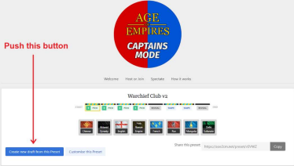
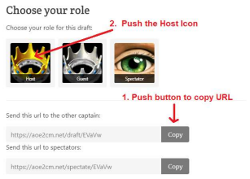
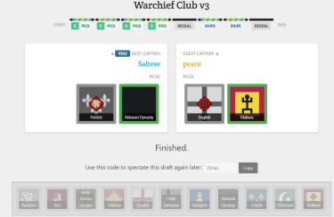
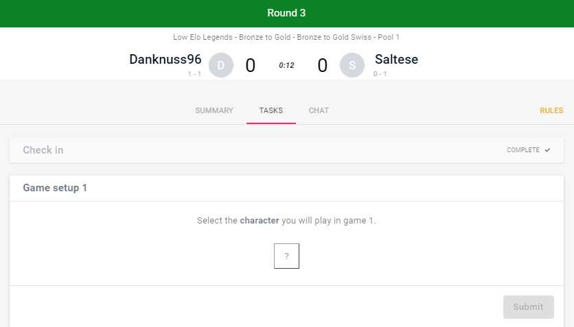
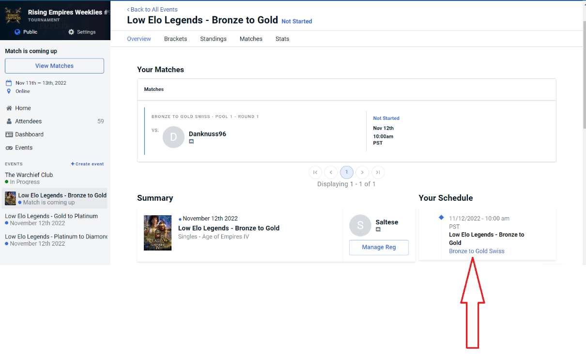
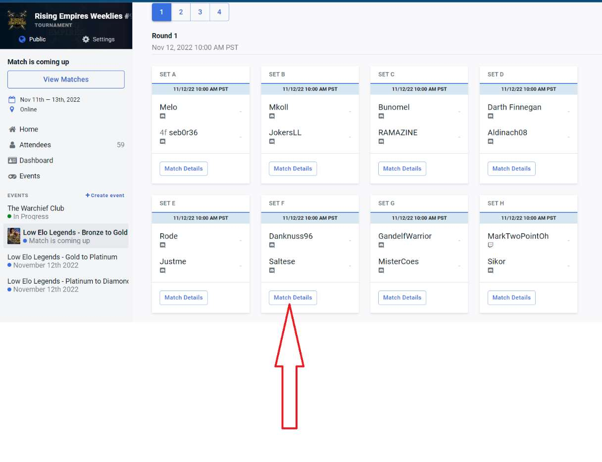
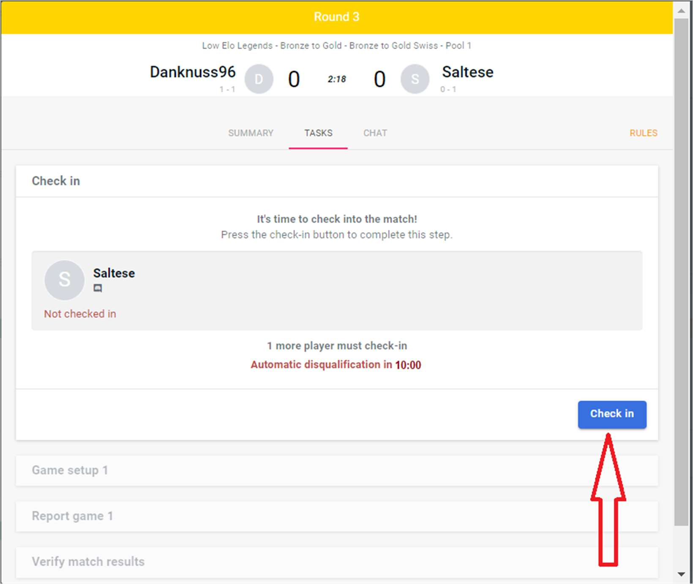
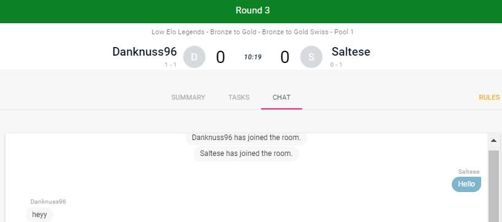
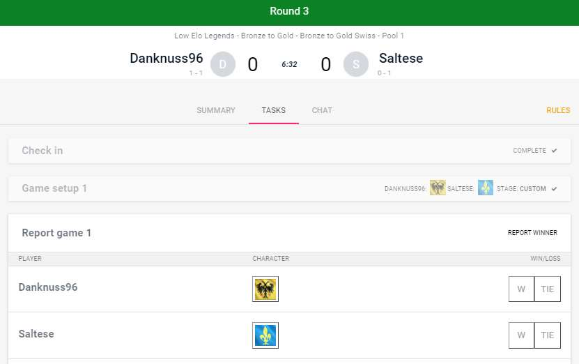
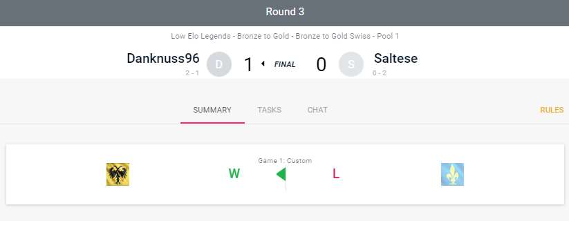

# Low Elo Legends Handbook

September 9 2023, Revision 6.

# Table of Contents

```
Introduction
The Low Elo Legends tournament
What is Start.gg?
Understanding the tournament format
The brackets, rounds, and matches
Civilization selection
How to use Captains Mode (The civilization draft application)
The map pool
Downloading custom maps
Downloading AOE4 game mods
Preparing for and playing in the tournament
How to register and get ready
On the day of the tournament
Directions for the tournament
FAQ’s
```

# Introduction

This guide is for players who are new to the Low Elo Legends AOE 4 tournament. Low Elo Legends
(LEL) is a tournament focused on competition among similar skilled players. There are generally
three events within the tournament designed for the following: Bottom Backet (<1100 Ranked Elo),
Middle Bracket (1050-1350 Racked Elo), and Top Bracket (1250-1475 Ranked Elo.) The Elo ranges are
approximate and may be adjusted slightly to balance the brackets. The maximum player rank for this
tournament is 1475 Elo. Players are seeded into the events according to their Age of Empires IV
ranked Elo, primarily. Organizers may also consider ranking, recent game history, and other
matchmaking data for seeding and qualification. The tournament organizers will do the final event
seeding just prior to the start of the tournament.

# The Low Elo Legends Tournament

The LEL tournament begins with a Swiss phase followed by a Finals phase. These phases are called
“brackets” in the tournament.

A Swiss bracket is like a round-robin in that no players are eliminated. Every player will participate
in each round, and the players earn points based on their wins as the bracket progresses. In the
first round only, high rated players are intentionally paired with low rated players. After the first
round of the Swiss bracket, pairings are based on performance. Those who won are matched with
other winners, losers with losers.

There are four rounds in the Swiss bracket. Depending on the number of the entrants, the 4 or 8
players with the most points at the end of the Swiss bracket move to Finals bracket. The Finals
bracket play is similar other single elimination tournaments. There is always a semi-final round
and a final round in the Finals bracket. If there are more that approximately 16 players in the
Swiss bracket, there may be a quarter-final round.

Note: In may be a little confusing, but the “Finals bracket” is not the same as the “final round”.
And the reference to “Brackets” in the Bottom, Middle, and Top Brackets for event seeding is
different than the Swiss and Finals “brackets” of the tournament.

# What is Start.gg?

Start.gg is an application that acts as your portal to the tournament. It is a platform used to create
customize tournaments like LEL. With Start.gg, you will: register, check-in, learn the rules, find your
matches, chat with your opponent, track your progress, and record your results. So, it is important
that you familiarize yourself with Start.gg. You can go to Start.gg at any time to look at the
application and play around with it.

Start.gg can be a little intimidating the first time you use it, but this handbook will help you navigate
it. You can also message any of the Admins to ask for help at @admins on the “Rising Empires AOE4”
Discord server.

To find the link to Start.gg, go to the “lel-announcements” channel on Discord. Or you can go to
[http://www.start.gg](http://www.start.gg) and search for “Rising Empires”, then select the most recent tournament.

# Understanding the tournament format

## The brackets, rounds, and matches

During each round of the tournament, you will either play one match (game) or the best of three
matches (games). The tournament rules refer to a one round match as “Bo1” and a round with the
best of three matches as “Bo3”.

There are four rounds in the Swiss bracket, and you will play one match during each round. There
are two or three rounds during the Finals bracket. You will play one match in the semi-final and
quarter-final round, and the best of three matches in the final round.

A third-place tiebreaker round is optional if both players want to play the round. If the players
agree to play a tiebreaker round, it is up to the players to determine if one (Bo1) or the best of
three matches (Bo3) is desired.

Below is a table showing the relationship between brackets, rounds, and matches:

|Bracket|Round|Match(s)|Note|
|---|---|---|---|
|Swizz|Rounds 1-4|Best of 1 (Bo1)||
|Finals|Round 1 (Quarter Final)|Best of 1 (Bo1)|Optional - If more than 16 Players|
|Finals|Round 1 or 2 (Semi Final)|Best of 1 (Bo1)||
|Finals|Round 2 or 3 (Final)|Best of 3 (Bo3)||


## Civilization selection

You will have to play different civilizations throughout the tournament. You will likely have to play
two different civilizations prior to the final round. You may have to play a third civilization in the
final round if there are three matches.

The table below shows how to select your civilization for each round. The same selection process
applies to your opponent as well.

|Bracket|Round|Civilization Selection|
|---|---|---|
|Swizz |Round 1-4|You pick two civilizations, then your opponent bans one of the two civilizations. You play the one not banned. |
|Finals|Quarter Final & Semi Final|You pick two civilizations, then your opponent bans one of the two civilizations. You play the one not banned. |
|Finals|Grand Final|For the first match of this round, you pick two civilizations, then your opponent bans one of the two civilizations. You play the one not banned. For the second match you do the same. However, if you won the prior match, you cannot select the civilization you just used to win. If there is a third match, use the same process as the second game.|


**Note:** The civilization draft application refers to a ban as a snipe.

For rounds with civilization bans, the tournament uses a turn-based civilization draft application to
assist you and your opponent to secretly pick your two civilizations and to allow both of you to
secretly ban one of them. The application is called “Age of Empires Captains Mode”
(www.aoe2cm.net). The Admins have created a Preset draft in Captains Mode based upon the
format of the LEL tournament. You will need a link to this Captains Mode Preset draft. You can
find the link to Captains Mode in the “Tournament Rules and Format > Civilizations” section on the
Start.gg home page. The “Preset Code” is embedded in the link so can see the code in the link.

Here is an example of the Captains Mode link format: https://aoe2cm.net/preset/byxel. The last
characters in the link “byxel” are the preset. This preset will change as tournaments evolve so
make sure you check the rules for the most up-to-date link.

See the section below to learn how to use Captains Mode.

If there is no civilization ban, enter your selected civilization when prompted for “Character” in
start.gg. The “Character” prompt is under the “Tasks” tab in start.gg.

# How to use AoE2CM (The civilization draft application)

The civilization draft application is called “Age of Empires Captains Mode” (www.aoe2cm.net).
When using the application, both players are captains, one captain has the role of the “Host” and
other captain has the role of the “Guest”. The following instructions assume that you will be the
“Host” and you will begin the civilization selection in Captains Mode for both you and your
opponent. These instructions are written as if you are at the point of picking the civilizations for a
match.

Note: You can practice using this application anytime. You can access the application outside of
the tournament time by selecting the link in the “Civilizations” section on the Start.gg home page.

1. Let’s start these instructions by assuming you are in the “Chat” tab in Start.gg and have just
   messaged your opponent and both of you have agreed that you will initiate Captain’s Mode.
2. Now go to Captains Mode on the Start.gg home page. In the “Civilizations” section, press
   the link next to “Link to Captains Mode (Civ picker).”
3. The link will open a new browser tab to the correct preset in the Captains Mode application.
   Now push the button, “Create a new draft from this preset”. See Figure 1.



4. Once you push the button, it will take you to the new draft for your match. On this page,
   you will select the Host role and copy the URL to send to the other captain (Your opponent).
5. Push the top “Copy” button called, “Send this URL to the other captain”. Note: It doesn’t
   really send the URL, it just copies it. You still need to send it. Next, select and push the
   “Host” icon for your role. See figure 2.


```
Figure 2: Captains Mode role selection screen.
```

6. Once selecting Host, Captains Mode takes you to the first step in the pick process. DO NOT
   push READY.


   Now is the time to ‘send’ the URL to the other captain. Go back to the “Chat” tab on the
   Start.gg match pop-up window, paste the copied link in the chat window for the other
   captain. See figure 3. (The other player will have to copy and paste this link into their
   browser to get to the same place as you in the application.)


```
Figure 3: Sending Captains Mode link in Start.gg Chat.
```

7. Once again, go back to the Captains Mode browser tab.
8. Now you can push the READY button.
9. Captains Mode will begin stepping both players through the turn-based process of secretly
   picking two civilizations and banning one. Note: The civilization draft application refers to
   a ban as a snipe.
10. When you reach the “Finished” step, both players will see with civilization they will play.
    Note: Remember your civilization pick. See figure 4.


```
Figure 4: Finished step in Captains Mode showing picked and ban civilizations.
```

11. Now go back Start.gg and change from the “Chat” tab to the “Tasks” tab. Enter your
    civilization selection as your “character. See figure 5.


```
Figure 5: Selecting character on the Start.gg Tasks tab.
```

12. You have completed the civilization selection. Remember to practice Captains Mode
    before the tournament.
13. At this point both players go to the AOE4 game and continue with the game chat.

The best way to learn the application is to practice this before the tournament. There is a “How it
works section” in the application. I recommend you familiarized yourself with the application prior
to the tournament as you don’t want the stress of figuring out this application while playing
competitive games. To practice, instead for sending the Captains Mode URL link to the other
player, just paste the link in a new browser window so you can proxy the other player.

# Map Pool

You will use predetermined maps in all rounds except a “Bo3 final” round. The “Map Pool” section
of Start.gg specifies the map to be used for each round. If there is quarter-final round, the map is
always “Dry Arabia”.

In a best of three final round (Bo3), each player will pick a “home map” from the map pool. The
players will then take turns banning the remaining maps in the pool until one remains. The last
remaining map will be the playoff map if the final round has a third game. To choose the map
selection and ban in the final round, use “Chat” in Start.gg to determine the “home maps” and the
third map.

### Finals Map Order
- Player 1 home map
- Player 2 home map
- Tiebreaker map

I would suggest reviewing the map pool early in the week of the tournament and use the maps
from the pool for practice throughout the week.

# How to download custom maps

1. From in the AOE4 game main menu click on “Mods.”
2. Next click “All Mods.”
3. Search “Generated Map” in the filter menu and then click the map you want.
4. Click “Subscribe.”

# How to download game mods

1. From in the AOE4 game main menu click on “Mods.”
2. Next click “All Mods.”
3. Search “Game Modes” with the filter menu and then click the mode you want
4. Click “Subscribe.”
5. Search “Tuning Pack” with the filter menu and then click the pack you want. Currently only the
   “Ruleset - Low Elo Legends” is needed.
6. Click “Subscribe.”

**Note:** If a mod causes issues, play without it.

# Preparing for and playing in the tournament

## How to register and get ready

1. Go to the Start.gg tournament page.
2. Review the “Tournament Rules and Format” on the Start.gg home page.
3. Register for the tournament in Start.gg using the “Join Now” button.

4. Go to the “Required mods” section under “Tournament Rules and Format > Format: > Game Setup” in Start.gg and download the mods to your AOE4 game.
5. Check the “Map Pool” on the Start.gg home page and download any custom maps to your AOE game.
6.  Go to the AOE4 game and add Moketronics7740 as a friend inside the game.
7. Accept friend requests from any casters inside AOE4. Note: Check for caster updates in Discord.
8. Familiarize yourself with the applications Start.gg and the Captains Mode (Civilization draft application) prior to the tournament. 

**Note:** If you have never played in this type of tournament, I promise you don’t want to be learning these applications during the tournament.

## On the day of the tournament

- Check the “low-elo-legends” Discord channel for general information prior to the tournament.
- Check-in 45 to 5 minutes prior to the start time of the tournament.
- Now just relax until the start and enjoy the [Twitch Stream](https://twitch.tv/risingempires)

## Directions for the tournament

-  Monitor the “low-elo-legends” Discord channel for general information during the tournament.
-  In Start.gg, go to your Event and select the “Overview” tab on the top left.
-  On the right side of the window, you will see “Your Schedule.” Select the link to the bracket.
See figure 6.

```
Figure 6: Link to your bracket under the start.gg schedule.
```

- Now look for your match and select the “Match Details” button. See figure 7 below.

```
Figure 7: Your Match Details in Start.gg.
```

- This will create a match window that will help you manage your match.
- Under the “Tasks” tab of the match window, check-in. Note: You will also get a Discord Bot DM ping if you haven’t checked-in prior to start. See figure 8 below.
- You have 10 minutes to check-in. If you don’t check-in within the 10-minute window, you will be disqualified.


```
Figure 8 - Check in on Start.gg Match Details window.
```

- Move to the “Chat” tab on the pop-up window to start a chat with your opponent. See figure 9.


```
Figure 9: Chat tab in Start.gg
```

- Message “hey” to your opponent. (See the FAQ’s if your opponent does check-in.)
- If there is a civilization band for this match, see “How to use Captains Mode” section of this handbook. If no ban, just go to the “Tasks” tab in Start.gg and select the civilization you want to play. You enter your civilization as the character. Once both players have selected their civilization, the task tab will show the selected civilizations. See figure 10.


```
Figure 10: Civilization selection on Tasks tab of Match Details.
```

- Now both players should go to the AOE4 game and friend each other. Use the AOE4 chat to determine who will setup the game.
- One player creates a custom lobby and invites other. Both players should review the settings and map to make sure everything is correct. I have found that you can’t assume the person setting up the game knows how to do correctly. See the “Tournament Rules and Format: > Game Setup” section on the Start.gg home page for the settings in the AOE4 game.
- Start the game. Good luck!
- After the game, don’t forget to go back to the match window in Start.gg to record the game results. Both players must record their results. See figure 11. It is not uncommon for a player to forget to go back and record the results so please remember to do this. It is extra work for the busy tournament coordinator to have to close-out the match results if you don’t do it. You do not need to upload a screenshot of the results unless there is a dispute.


```
Figure 11: Start.gg match report window under the Tasks tab.
```

- If the other matches in this round are not finished, you can take a break until all matches in this round are finished.
- Once all matches are finished, repeat this process for each match.
- Have fun!

**Note:** It is helpful to have two computers. One for the AOE4 game and the other for Discord,
Start.gg, and Captains Mode. You can do it with one computer, you just have a little more hopping
between windows.

# FAQ

**How much time should I plan for the tournament?**
4 to 7 hours.


**What if I registered and can't attend?**
Message @admins on the “low-elo-legends” Discord channel as early as possible to let them know. Once the bracket has started, it is difficult to remove players from the bracket so please notify the Admins before the tournament starts.

**What if I must leave the tournament early?**
Please message @admins on the “low-elo-legends” Discord channel before the next round starts. Removal once the next round begins causes much more significant disruption so, please alert the admins before the next round begins. We encourage all players to complete the Swiss bracket so the other players have the opportunity to play four games during the Swiss bracket.

**What to do if I miss check in and wish to enter late?**
You can be added after Round 1. Message @admins on the “low-elo-legends” Discord channel. Late entries will not be taken after the start of Round 2.

**Can I take a break between games?**
Yes. If your match finishes before the other matches in the round, you will have a break until the next rounds start. If your game is the last in the round, check-in to Start.gg and message your next opponent using Chat before taking the break. Let them know you need a few minutes. Please try to limit your break to 5 minutes in this case.

**What if I can't find my opponent?**
The first place to look for your opponent is the Chat tab in Start.gg. Next, go to the Discord channel “lel-find-opponent”. If that doesn’t work, go to the main “low-elo-legends” Discord channel, and ask the Moderator for help.

**Who sets up the AOE4 game and invites the other player?**
When both players go to the AOE4 and start the chat, decide which one of you wants to setup the game. If there is any disagreement on who should start, the top seed player or top listed player in the match sets up the game.

**What if the map generation doesn’t look right?**
See the “map restarts” section in Start.gg.

**What biome do I select?**
The player setting up the AOE4 game chooses the biome.

**What if the game crashes?**
See the “map restarts” section in Start.gg.

**What happens if there is a tie in the Swiss bracket?**
Swiss bracket tie breaks are decided based on swiss points, followed by opponent's opponent's
win %.

**What happens with a Bye?**
If there is an uneven number of players in the event, byes go to the mid rank player in the first round, then lowest ranked player in proceeding rounds. Byes count as a win. Start.gg automatically moves the player to the next round so you don’t need to do anything in Start.gg. Hang around until all the matches in the round have started before taking a break. Sometimes the Moderator needs to make changes that could affect the Bye. Don’t forget to pay attention to Start.gg so know when the next round starts. It is common for players to lose track of time and be late for their next match. This delays the tournament for everyone. Meanwhile, the coordinator and your opponent player are messaging all the channels to try and find you.

**What if I have problems or questions?**
Message the @admins on the “low-elo-legends” Discord channel.

**What channels do I use in Discord?**
_#lel-announcements_ - This is for LEL tournament announcements before and after the tournament. You will find the winners announcement here.

_#low-elo-legends_ – This is for general conversation about the tournament. This is where to reach the Moderator during the tournament.

_#lel-quide_ – Download the tournament handbook from here. Read the handbook before the tournament.

_#lel-find-opponent_ - If you can’t find your opponent in the Start.gg Chat, go to here.

_#lel-streaming-the-tourney_ – This is where you can find the links to the tournament streaming.

**What is the prize pool?**
$10 for first place and $5 for second place.
